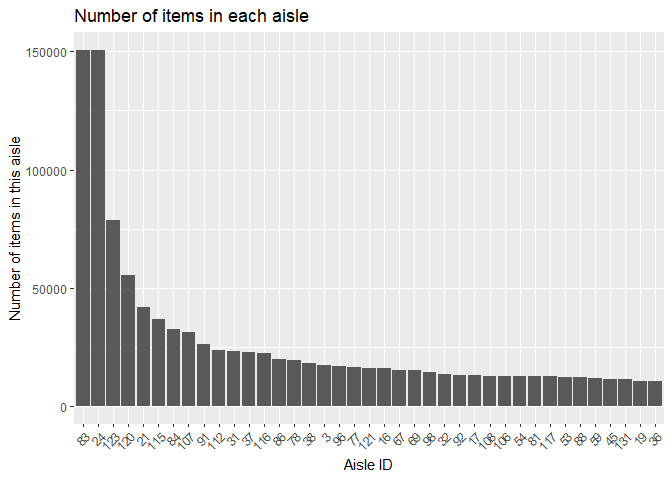
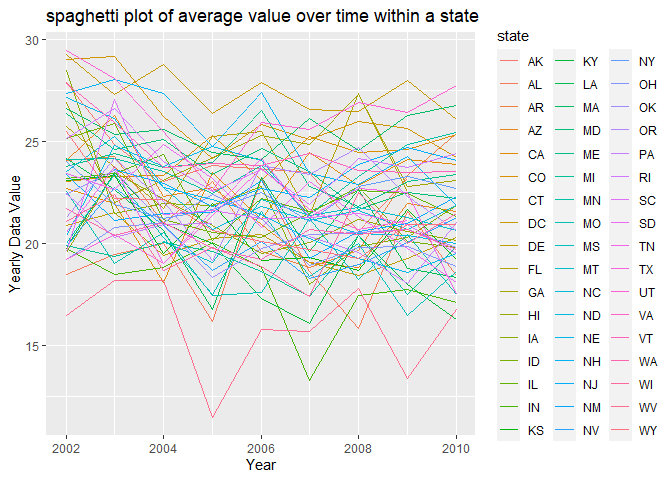
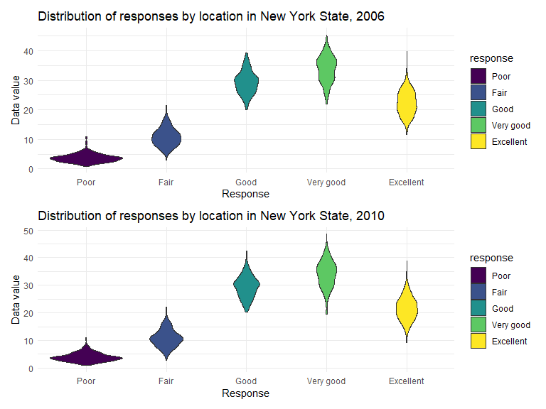
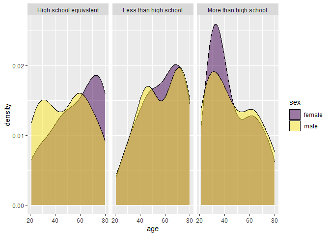

hw3-8105
================
Chenshuo Pan

# Question1:

``` r
#read dataset
library(p8105.datasets)
data("instacart")
```

**write a short description of the dataset, noting the size and
structure of the data, describing some key variables, and giving
illstrative examples of observations.**

This dataset has 1384617 rows and 15 columns ,The key variables
include:order_id, product_id, add_to_cart_order, reordered, user_id,
eval_set, order_number, order_dow, order_hour_of_day,
days_since_prior_order, product_name, aisle_id, department_id, aisle,
department.

(From the description of this data on the course website,we can describe
the key variables as follows)

`order_id`: order identifier

`product_id`: product identifier

`add_to_cart_order`: order in which each product was added to cart

`reordered`: 1 if this prodcut has been ordered by this user in the
past, 0 otherwise

`user_id`: customer identifier

`eval_set`: which evaluation set this order belongs in (Note that the
data for use in this class is exclusively from the “train” eval_set)

`order_number`: the order sequence number for this user (1=first, n=nth)

`order_dow`: the day of the week on which the order was placed

`order_hour_of_day`: the hour of the day on which the order was placed

`days_since_prior_order`: days since the last order, capped at 30, NA if
order_number=1

`product_name`: name of the product

`aisle_id`: aisle identifier

`department_id`: department identifier

`aisle`: the name of the aisle

`department`: the name of the department

``` r
#an example of observation data

instacart%>%filter(user_id ==21)
```

    ## # A tibble: 6 × 15
    ##   order_id product_id add_to_cart_order reordered user_id eval_set order_number
    ##      <int>      <int>             <int>     <int>   <int> <chr>           <int>
    ## 1  1854765      25740                 1         1      21 train              34
    ## 2  1854765      12683                 2         1      21 train              34
    ## 3  1854765      44632                 3         1      21 train              34
    ## 4  1854765      10957                 4         1      21 train              34
    ## 5  1854765      32645                 5         1      21 train              34
    ## 6  1854765      16615                 6         0      21 train              34
    ## # ℹ 8 more variables: order_dow <int>, order_hour_of_day <int>,
    ## #   days_since_prior_order <int>, product_name <chr>, aisle_id <int>,
    ## #   department_id <int>, aisle <chr>, department <chr>

Take user No. 21 as an example. This user purchased 6 products, 5 of
which this customer has purchased in the past. The order number is 34,
and the order date is 12 o’clock on Monday. It has been 28 days since
this customer last placed an order. This data also includes information
such as the type of product purchased by the customer, the department to
which the product belongs, and the aisle.

**How many aisles are there, and which aisles are the most items ordered
from?**

``` r
aisle_rank <-instacart%>%
  group_by(aisle_id)%>%
  summarise(aisle_number=n())%>%
  arrange(desc(aisle_number))

#show the most items aisle id
head(aisle_rank,1)
```

    ## # A tibble: 1 × 2
    ##   aisle_id aisle_number
    ##      <int>        <int>
    ## 1       83       150609

There are totally 134 aisles, among those `aisle_id = 83` which is fresh
vegetables are the most items. The number is 150609

**Make a plot that shows the number of items ordered in each aisle,
limiting this to aisles with more than 10000 items ordered. Arrange
aisles sensibly, and organize your plot so others can read it.**

``` r
#keep aisles with more than 10000 items

instacart_10000 <- aisle_rank%>%
  filter(aisle_number >= 10000)

  
instacart_10000%>%
  mutate(aisle_id = reorder(aisle_id,aisle_number))%>%
  ggplot(aes(x = aisle_id,y = aisle_number))+
  geom_point(stat = "identity")+
  labs(title = "Number of items in each aisle",
       x = "Aisle ID",
       y = "Number of items in this aisle")+
  theme(axis.text.x = element_text(angle = 60, hjust = 1))+
  theme_minimal()
```


Here are the images arranged from small to large according to the number
of items according to Aisle ID.

**Make a table showing the three most popular items in each of the
aisles “baking ingredients”, “dog food care”, and “packaged vegetables
fruits”. Include the number of times each item is ordered in your
table.**

``` r
#choose most 3 items in specified aisles
most3_item <- instacart %>%
  filter(aisle %in% c("baking ingredients", "dog food care", "packaged vegetables fruits"))%>%
  group_by(aisle,product_name)%>%
  summarise(product_number = n(),.groups = 'keep')%>%
  arrange(aisle,desc(product_number))%>%
  group_by(aisle)%>%
  top_n(3,product_number)


most3_item
```

    ## # A tibble: 9 × 3
    ## # Groups:   aisle [3]
    ##   aisle                      product_name                         product_number
    ##   <chr>                      <chr>                                         <int>
    ## 1 baking ingredients         Light Brown Sugar                               499
    ## 2 baking ingredients         Pure Baking Soda                                387
    ## 3 baking ingredients         Cane Sugar                                      336
    ## 4 dog food care              Snack Sticks Chicken & Rice Recipe …             30
    ## 5 dog food care              Organix Chicken & Brown Rice Recipe              28
    ## 6 dog food care              Small Dog Biscuits                               26
    ## 7 packaged vegetables fruits Organic Baby Spinach                           9784
    ## 8 packaged vegetables fruits Organic Raspberries                            5546
    ## 9 packaged vegetables fruits Organic Blueberries                            4966

First, select three specified aisles, calculate the quantity of each of
them, group each aisle again, and use top_n to calculate the three
largest products among them.

**Make a table showing the mean hour of the day at which Pink Lady
Apples and Coffee Ice Cream are ordered on each day of the week; format
this table for human readers (i.e. produce a 2 x 7 table).**

``` r
#using group_by to help us calculate the mean hour of the day,then create table
instacart %>%
  filter(product_name %in% c("Pink Lady Apples", "Coffee Ice Cream"))%>%
  group_by(product_name,order_dow)%>%
  summarise(mean_hour = mean(order_hour_of_day),.groups = 'keep')%>%
  mutate(order_dow = case_when(
    order_dow == 0 ~ "Sunday",
    order_dow == 1 ~ "Monday",
    order_dow == 2 ~ "Tuesday",
    order_dow == 3 ~ "Wednesday",
    order_dow == 4 ~ "Thursday",
    order_dow == 5 ~ "Friday",
    order_dow == 6 ~ "Saturday",
  ))%>%
  pivot_wider(names_from = "order_dow",values_from = mean_hour)
```

    ## # A tibble: 2 × 8
    ## # Groups:   product_name [2]
    ##   product_name     Sunday Monday Tuesday Wednesday Thursday Friday Saturday
    ##   <chr>             <dbl>  <dbl>   <dbl>     <dbl>    <dbl>  <dbl>    <dbl>
    ## 1 Coffee Ice Cream   13.8   14.3    15.4      15.3     15.2   12.3     13.8
    ## 2 Pink Lady Apples   13.4   11.4    11.7      14.2     11.6   12.8     11.9

It can be seen that except for Friday, Pink Lady Apples are generally
purchased slightly earlier in the day than Coffee Ice Cream. The data in
the table is time

# Question2:

``` r
#read dataset
data("brfss_smart2010")
```

**do some data cleaning:** **format the data to use appropriate variable
names;** **focus on the “Overall Health” topic** **include only
responses from “Excellent” to “Poor”** **organize responses as a factor
taking levels ordered from “Poor” to “Excellent”**

``` r
#clean dataset
brfss_clean <- brfss_smart2010%>%
#clean column names,and rename them reasonablely
  janitor::clean_names()%>%
  rename(state = locationabbr,state_county = locationdesc) %>%
#focus on Overall Health topic and keep the required response
  filter(topic == "Overall Health") %>%
  filter(response %in% c("Excellent", "Very good", "Good", "Fair", "Poor"))%>%
#convert respnse to factor
  mutate(response = factor(response,
         levels = c("Poor", "Fair", "Good", "Very good", "Excellent")))
```

After cleaning the data as required, we renamed the `locationabbr`
column to `state`, and changed `locationdesc` to `state_county`. I think
this naming makes it more intuitive to understand the content of each
column. Finally we got the data set of 23 columns, 10625 observations.

**In 2002, which states were observed at 7 or more locations? What about
in 2010?**

``` r
#select observations we want
brfss_2002 <- brfss_clean %>%
#select 2002 data
  filter(year == 2002)%>%
  group_by(state)%>%
#calculate how many locations in each unique county in 2002
  summarise(n=length(unique(state_county)))%>%
#keep those with more than 7 locations
  filter(n >= 7)

brfss_2002
```

    ## # A tibble: 6 × 2
    ##   state     n
    ##   <chr> <int>
    ## 1 CT        7
    ## 2 FL        7
    ## 3 MA        8
    ## 4 NC        7
    ## 5 NJ        8
    ## 6 PA       10

``` r
brfss_2010 <- brfss_clean %>%
#select 2010 data
  filter(year == 2010)%>%
  group_by(state)%>%
#calculate how many locations in each unique county in 2010
  summarise(n=length(unique(state_county)))%>%
  filter(n >= 7)

brfss_2010
```

    ## # A tibble: 14 × 2
    ##    state     n
    ##    <chr> <int>
    ##  1 CA       12
    ##  2 CO        7
    ##  3 FL       41
    ##  4 MA        9
    ##  5 MD       12
    ##  6 NC       12
    ##  7 NE       10
    ##  8 NJ       19
    ##  9 NY        9
    ## 10 OH        8
    ## 11 PA        7
    ## 12 SC        7
    ## 13 TX       16
    ## 14 WA       10

There are totally 6 states were observed at 7 or more locations in 2002
.They are CT, FL, MA, NC, NJ, PA

There are totally 14 states were observed at 7 or more locations in 2010
.They are CA, CO, FL, MA, MD, NC, NE, NJ, NY, OH, PA, SC, TX, WA

**Construct a dataset that is limited to Excellent responses, and
contains, year, state, and a variable that averages the data_value
across locations within a state. Make a “spaghetti” plot of this average
value over time within a state (that is, make a plot showing a line for
each state across years – the geom_line geometry and group aesthetic
will help).**

``` r
#Construct a dataset that is limited to Excellent responses,and calculate average value
state_response <- brfss_clean%>%
#choose those lines whose response is excellent
  filter(response == "Excellent")%>%
  group_by(year,state,state_county)%>%
#calculate the mean by group
  summarise(average_value = mean(data_value),.groups = "keep")

state_response
```

    ## # A tibble: 2,125 × 4
    ## # Groups:   year, state, state_county [2,125]
    ##     year state state_county                average_value
    ##    <int> <chr> <chr>                               <dbl>
    ##  1  2002 AK    AK - Anchorage Municipality          27.9
    ##  2  2002 AL    AL - Jefferson County                18.5
    ##  3  2002 AR    AR - Pulaski County                  24.1
    ##  4  2002 AZ    AZ - Maricopa County                 21.6
    ##  5  2002 AZ    AZ - Pima County                     26.6
    ##  6  2002 CA    CA - Los Angeles County              22.7
    ##  7  2002 CO    CO - Adams County                    21.2
    ##  8  2002 CO    CO - Arapahoe County                 25.5
    ##  9  2002 CO    CO - Denver County                   22.2
    ## 10  2002 CO    CO - Jefferson County                23.4
    ## # ℹ 2,115 more rows

``` r
#draw spaghetti plot

spaghetti_plot <- state_response%>%
  group_by(year,state)%>%
  #calculate the average value of each year and state
  summarise(year_value = mean(average_value),.groups = "keep")%>%
  ggplot(aes(x = year,y = year_value,color = state,group = state))+
  #spaghetti plot
  geom_line()+
  labs(title = "spaghetti plot of average value over time within a state",
       x = "Year",
       y = "Yearly Data Value") 

spaghetti_plot
```



Comment: I noticed that overall during the period 2002-2010, there was
no obvious upward or downward trend in the average values of different
states. But there are some details worth noting. For example, from 2004
to 2005, basically all states experienced a significant decline in the
average value for that year. At the same time, the average values vary
greatly between different states. The average value of DC is always
higher than that of other states, and the average value of WV is the
lowest most of the time.

**Make a two-panel plot showing, for the years 2006, and 2010,
distribution of data_value for responses (“Poor” to “Excellent”) among
locations in NY State.**

``` r
# draw violin plot for the years 2006, and 2010, distribution of data_value for responses
violin_plot <-brfss_clean%>%
#choose those data that year is 2010 and state is NY
  filter((year==2010| year == 2006) & state == "NY") %>%
#set response to x ,data_value to y
  ggplot(aes(x = response, y = data_value))+
  geom_violin(aes(fill = response))+
#create panel according to years
  facet_wrap(~year, nrow = 2)+
  viridis::scale_fill_viridis(discrete = TRUE)+
  labs(title = "Distribution of responses by location in New York State for year 2006 and 2010",
       x = "Response",
       y = "Data value")+
  theme_minimal()+
  theme(legend.position = 'none')

violin_plot
```



Comment: First, compare the overall distribution of 2006 and 2010. There
is no obvious distribution difference between the two pictures, so they
are similar. Judging from the average value and shape of each violin
plot, the average value corresponding to `poor` is the lowest, and the
graph of poor is very wide, which proves that a large amount of data is
concentrated in the interval around 5. The highest average value is for
`very good` rather than `excellent`(It is determined by the numerical
value and shape of the distribution.), which is surprising.Except
excellent ,the other average values are sorted according to the meaning
of their categories(like Good \> Fair \>Poor).

# Question3:

``` r
#Read csv dataset
covar <- read.csv("./data/nhanes_covar.csv",skip = 4,header = TRUE)
accel <- read.csv("./data/nhanes_accel.csv",header = TRUE)
```

**Load, tidy, merge, and otherwise organize the data sets. Your final
dataset should include all originally observed variables; exclude
participants less than 21 years of age, and those with missing
demographic data; and encode data with reasonable variable classes
(i.e. not numeric, and using factors with the ordering of tables and
plots in mind).**

``` r
#clean covar dataset
covar_clean <- covar%>%
#clean column names
  janitor::clean_names()%>%
#convert sex variables to factor with 2 levels
  mutate(sex = factor(case_when(
    sex == 1 ~ "male",
    sex == 2 ~ "female"
  )),
#convert education variables to factor with 3 levels
  education = factor(case_when(
    education == 1 ~"Less than high school",
    education == 2 ~"High school equivalent",
    education == 3 ~"More than high school"
  ),levels = c("Less than high school","High school equivalent","More than high school"))) %>%
#keep data with age greater and equal than 21 and delete NA
  filter(age >=21)%>%
  na.omit()


#clean accel dataset
accel_clean <- accel%>%
  janitor::clean_names()
```

``` r
#combine accel and covar table
combine_table<-covar_clean%>%
#using inner join to make sure the dataset we created can satisfy the requirements
  inner_join(accel_clean,by = "seqn")%>%
#convert into a long table
  pivot_longer(min1:min1440,names_to = "time", values_to = "mims")%>%
  na.omit()


#show some of combined table

head(combine_table,5)
```

    ## # A tibble: 5 × 7
    ##    seqn sex     age   bmi education              time   mims
    ##   <int> <fct> <int> <dbl> <fct>                  <chr> <dbl>
    ## 1 62161 male     22  23.3 High school equivalent min1  1.11 
    ## 2 62161 male     22  23.3 High school equivalent min2  3.12 
    ## 3 62161 male     22  23.3 High school equivalent min3  1.47 
    ## 4 62161 male     22  23.3 High school equivalent min4  0.938
    ## 5 62161 male     22  23.3 High school equivalent min5  1.60

I first process the two data sets separately and then merge them.Because
we want to exclude data from participants with missing demographic data,
I use inner_join to ensure that the generated data is complete for each
item, and `na.omit` again to ensure that no missing data exists

**Produce a reader-friendly table for the number of men and women in
each education category, and create a visualization of the age
distributions for men and women in each education category. Comment on
these items.**

``` r
#table for the number of men and women in each education category
age_distribution_table <- combine_table%>%
  select(seqn,sex,age,education)%>%
  group_by(education,sex)%>%
#using unique() to make sure each seqn(paticipants) only appear once
  unique()%>%
#summarize the number ,mean age of people in each education level
#mean age used for analysis later
  summarise(number_of_people=n(),mean_age = mean(age),median_age = median(age))

#show table
age_distribution_table
```

    ## # A tibble: 6 × 5
    ## # Groups:   education [3]
    ##   education              sex    number_of_people mean_age median_age
    ##   <fct>                  <fct>             <int>    <dbl>      <dbl>
    ## 1 Less than high school  female               28     57.5       61  
    ## 2 Less than high school  male                 27     57.2       60  
    ## 3 High school equivalent female               23     57.4       62  
    ## 4 High school equivalent male                 35     49.4       53  
    ## 5 More than high school  female               59     45.7       41  
    ## 6 More than high school  male                 56     46.6       43.5

``` r
#age value only in covar ,so we use covar_clean dataset to plot
age_distribution_plot <- covar_clean%>%
  ggplot(aes(x = age , fill = sex,))+
#draw a density plot
  geom_density(alpha = 0.5)+
#divide into different plot according to education level
  facet_grid(~education)+ 
  viridis::scale_fill_viridis(discrete = TRUE)+
  labs(title = "Density plot of age distribution at different education levels",
       x = "Age",
       y = "Density")+
  theme_minimal()

#show plot
age_distribution_plot
```


Comment: Combining the density plot and the information about the median
and mean that I gave in the table, we can find that in the group of Less
than high school, the values of men and women are similar, and the
distribution of the data is also similar. In the High school equivalent
group, the average age of men is significantly younger than that of
women. It can be seen from the density map that women at this level are
mainly aged after 60, while there are significantly more men in younger
age groups than women. Finally, in the More than high school group, the
average age of women is lower than that of men. It can also be seen from
the figure that most women with this education level are around 30 years
old.

**Traditional analyses of accelerometer data focus on the total activity
over the day. Using your tidied dataset, aggregate across minutes to
create a total activity variable for each participant. Plot these total
activities (y-axis) against age (x-axis); your plot should compare men
to women and have separate panels for each education level. Include a
trend line or a smooth to illustrate differences. Comment on your
plot.**

``` r
#plot total activities (y-axis) against age (x-axis)
daily_activity_plot <- combine_table%>%
  group_by(sex,age,education,seqn)%>%
#Calculate total daily activity based on factors such as age, education level, etc.
  summarise(total = sum(mims))%>%
  ggplot(aes(x = age , y = total,color = sex))+
  geom_point(alpha = 0.5)+
#add a trend line 
  geom_smooth(se = FALSE)+
#Plotted separately according to different education levels
  facet_grid(.~education)+
  labs(title = "Scatter plot of total daily physical activity by age",
       x = "Age",
       y = "Total Physical activity per day")+
  theme_minimal()


daily_activity_plot
```

    ## `geom_smooth()` using method = 'loess' and formula = 'y ~ x'


Comment: Although total activity fluctuates somewhat with age, overall
activity decreases with age (for all education levels and genders). It
can be seen from the `smmoth` curve that at the education level of Less
than high school, men’s total activity after the age of 40 is greater
than that of women. For the two education levels of High school
equivalent and More than high school, the total activity volume of women
is always higher than that of men.

**Accelerometer data allows the inspection activity over the course of
the day. Make a three-panel plot that shows the 24-hour activity time
courses for each education level and use color to indicate sex. Describe
in words any patterns or conclusions you can make based on this graph;
including smooth trends may help identify differences.**

``` r
#Make a three-panel plot that shows the 24-hour activity time courses for each education level and use color to indicate sex.

mins_plot <- combine_table%>%
#using gsub to delete the min words in each time variables, and then convert them to numeric
  mutate(time = as.numeric(gsub("min", "", time)))%>%
  arrange(time)%>%
  ggplot(aes(x = time, y = mims,color = sex ))+
  geom_point(alpha = 0.5)+
#Plotted separately according to different education levels
  facet_wrap(~ education)+
#add a trend line
  geom_smooth(se = FALSE) +
  labs(title = "Scatter plot of mims for different education levels of the day",
       x = "every minute of the day",
       y = "MiMs value")+
  theme_minimal()+
  viridis::scale_color_viridis(discrete = TRUE)


mins_plot
```

    ## `geom_smooth()` using method = 'gam' and formula = 'y ~ s(x, bs = "cs")'


Comment: Although it is difficult to obtain valid information from the
scatter plot, the smooth curve I constructed shows that men and women
perform similarly at three different levels of education. In other
words, gender and education level have no significant impact on people’s
physical activity throughout the day.
