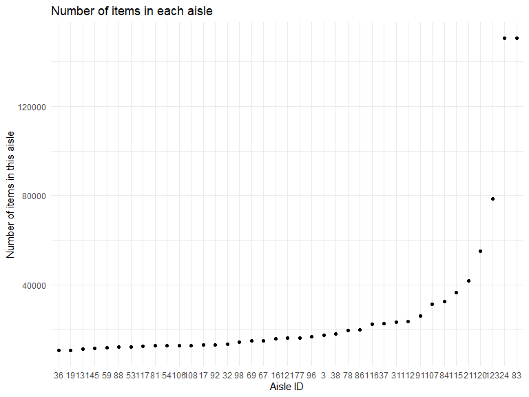

hw3-8105
================
Chenshuo Pan
2023-10-07

``` r
library(tidyverse)
```

    ## ── Attaching core tidyverse packages ──────────────────────── tidyverse 2.0.0 ──
    ## ✔ dplyr     1.1.3     ✔ readr     2.1.4
    ## ✔ forcats   1.0.0     ✔ stringr   1.5.0
    ## ✔ ggplot2   3.4.3     ✔ tibble    3.2.1
    ## ✔ lubridate 1.9.2     ✔ tidyr     1.3.0
    ## ✔ purrr     1.0.2     
    ## ── Conflicts ────────────────────────────────────────── tidyverse_conflicts() ──
    ## ✖ dplyr::filter() masks stats::filter()
    ## ✖ dplyr::lag()    masks stats::lag()
    ## ℹ Use the conflicted package (<http://conflicted.r-lib.org/>) to force all conflicts to become errors

``` r
library(ggplot2)
```

# Question1:

``` r
#read dataset
library(p8105.datasets)
data("instacart")
```

**write a short description of the dataset, noting the size and
structure of the data, describing some key variables, and giving
illstrative examples of observations.**

This dataset has 1384617 rows and 15 columns ,The key variables
include:order_id, product_id, add_to_cart_order, reordered, user_id,
eval_set, order_number, order_dow, order_hour_of_day,
days_since_prior_order, product_name, aisle_id, department_id, aisle,
department.

(From the description of this data on the course website,we can describe
the key variables as follows)

`order_id`: order identifier

`product_id`: product identifier

`add_to_cart_order`: order in which each product was added to cart

`reordered`: 1 if this prodcut has been ordered by this user in the
past, 0 otherwise

`user_id`: customer identifier

`eval_set`: which evaluation set this order belongs in (Note that the
data for use in this class is exclusively from the “train” eval_set)

`order_number`: the order sequence number for this user (1=first, n=nth)

`order_dow`: the day of the week on which the order was placed

`order_hour_of_day`: the hour of the day on which the order was placed

`days_since_prior_order`: days since the last order, capped at 30, NA if
order_number=1

`product_name`: name of the product

`aisle_id`: aisle identifier

`department_id`: department identifier

`aisle`: the name of the aisle

`department`: the name of the department

``` r
#an example of observation data

instacart%>%filter(user_id ==21)
```

    ## # A tibble: 6 × 15
    ##   order_id product_id add_to_cart_order reordered user_id eval_set order_number
    ##      <int>      <int>             <int>     <int>   <int> <chr>           <int>
    ## 1  1854765      25740                 1         1      21 train              34
    ## 2  1854765      12683                 2         1      21 train              34
    ## 3  1854765      44632                 3         1      21 train              34
    ## 4  1854765      10957                 4         1      21 train              34
    ## 5  1854765      32645                 5         1      21 train              34
    ## 6  1854765      16615                 6         0      21 train              34
    ## # ℹ 8 more variables: order_dow <int>, order_hour_of_day <int>,
    ## #   days_since_prior_order <int>, product_name <chr>, aisle_id <int>,
    ## #   department_id <int>, aisle <chr>, department <chr>

Take user No. 21 as an example. This user purchased 6 products, 5 of
which this customer has purchased in the past. The order number is 34,
and the order date is 12 o’clock on Monday. It has been 28 days since
this customer last placed an order. This data also includes information
such as the type of product purchased by the customer, the department to
which the product belongs, and the aisle.

**How many aisles are there, and which aisles are the most items ordered
from?**

``` r
aisle_rank <-instacart%>%
  group_by(aisle_id)%>%
  summarise(aisle_number=n())%>%
  arrange(desc(aisle_number))

head(aisle_rank,1)
```

    ## # A tibble: 1 × 2
    ##   aisle_id aisle_number
    ##      <int>        <int>
    ## 1       83       150609

There are totally 134 aisles, among those `aisle_id = 83` which is fresh
vegetables are the most items. The number is 150609

**Make a plot that shows the number of items ordered in each aisle,
limiting this to aisles with more than 10000 items ordered. Arrange
aisles sensibly, and organize your plot so others can read it.**

``` r
#keep aisles with more than 10000 items

instacart_10000 <- aisle_rank%>%
  filter(aisle_number >= 10000)

  
instacart_10000%>%
  mutate(aisle_id = reorder(aisle_id,desc(aisle_number)))%>%
  ggplot(aes(x = aisle_id,y = aisle_number))+
  geom_bar(stat = "identity")+
  labs(title = "Number of items in each aisle",
       x = "Aisle ID",
       y = "Number of items in this aisle")+
  theme(axis.text.x = element_text(angle = 45, hjust = 1))
```

<!-- -->

**Make a table showing the three most popular items in each of the
aisles “baking ingredients”, “dog food care”, and “packaged vegetables
fruits”. Include the number of times each item is ordered in your
table.**

``` r
most3_item <- instacart %>%
  filter(aisle %in% c("baking ingredients", "dog food care", "packaged vegetables fruits"))%>%
  group_by(aisle,product_name)%>%
  summarise(product_number = n(),.groups = 'keep')%>%
  arrange(aisle,desc(product_number))%>%
  group_by(aisle)%>%
  top_n(3,product_number)


most3_item
```

    ## # A tibble: 9 × 3
    ## # Groups:   aisle [3]
    ##   aisle                      product_name                         product_number
    ##   <chr>                      <chr>                                         <int>
    ## 1 baking ingredients         Light Brown Sugar                               499
    ## 2 baking ingredients         Pure Baking Soda                                387
    ## 3 baking ingredients         Cane Sugar                                      336
    ## 4 dog food care              Snack Sticks Chicken & Rice Recipe …             30
    ## 5 dog food care              Organix Chicken & Brown Rice Recipe              28
    ## 6 dog food care              Small Dog Biscuits                               26
    ## 7 packaged vegetables fruits Organic Baby Spinach                           9784
    ## 8 packaged vegetables fruits Organic Raspberries                            5546
    ## 9 packaged vegetables fruits Organic Blueberries                            4966

**Make a table showing the mean hour of the day at which Pink Lady
Apples and Coffee Ice Cream are ordered on each day of the week; format
this table for human readers (i.e. produce a 2 x 7 table).**

``` r
instacart %>%
  filter(product_name %in% c("Pink Lady Apples", "Coffee Ice Cream"))%>%
  group_by(product_name,order_dow)%>%
  summarise(mean_hour = mean(order_hour_of_day),.groups = 'keep')%>%
  mutate(order_dow = case_when(
    order_dow == 0 ~ "Sunday",
    order_dow == 1 ~ "Monday",
    order_dow == 2 ~ "Tuesday",
    order_dow == 3 ~ "Wednesday",
    order_dow == 4 ~ "Thursday",
    order_dow == 5 ~ "Friday",
    order_dow == 6 ~ "Saturday",
  ))%>%
  pivot_wider(names_from = "order_dow",values_from = mean_hour)
```

    ## # A tibble: 2 × 8
    ## # Groups:   product_name [2]
    ##   product_name     Sunday Monday Tuesday Wednesday Thursday Friday Saturday
    ##   <chr>             <dbl>  <dbl>   <dbl>     <dbl>    <dbl>  <dbl>    <dbl>
    ## 1 Coffee Ice Cream   13.8   14.3    15.4      15.3     15.2   12.3     13.8
    ## 2 Pink Lady Apples   13.4   11.4    11.7      14.2     11.6   12.8     11.9

# Question2:
