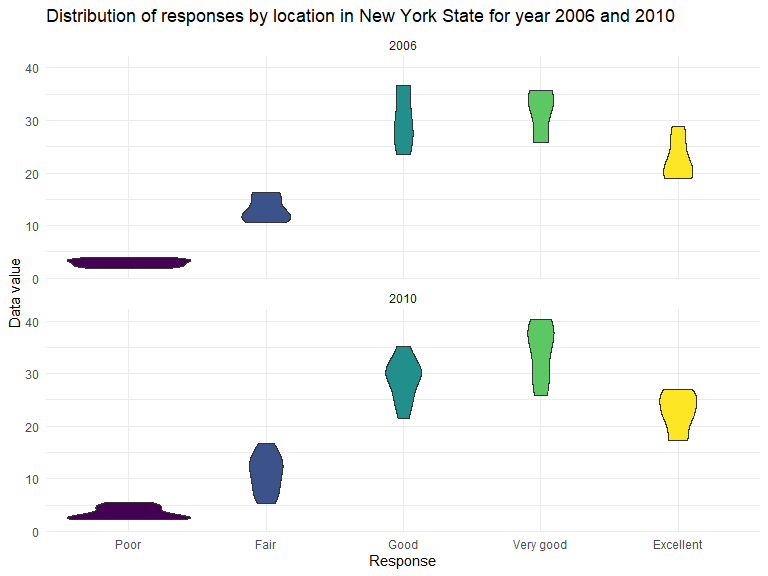
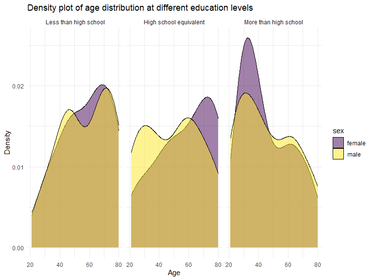
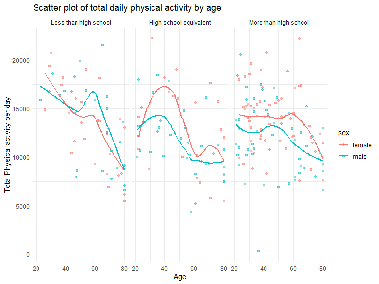
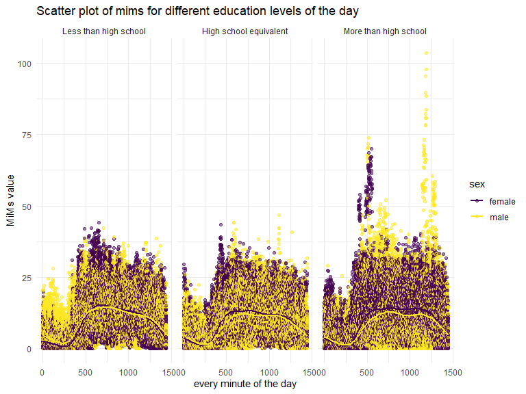

hw3-8105
================
Chenshuo Pan

``` r
library(tidyverse)
```

    ## ── Attaching core tidyverse packages ──────────────────────── tidyverse 2.0.0 ──
    ## ✔ dplyr     1.1.3     ✔ readr     2.1.4
    ## ✔ forcats   1.0.0     ✔ stringr   1.5.0
    ## ✔ ggplot2   3.4.3     ✔ tibble    3.2.1
    ## ✔ lubridate 1.9.2     ✔ tidyr     1.3.0
    ## ✔ purrr     1.0.2     
    ## ── Conflicts ────────────────────────────────────────── tidyverse_conflicts() ──
    ## ✖ dplyr::filter() masks stats::filter()
    ## ✖ dplyr::lag()    masks stats::lag()
    ## ℹ Use the conflicted package (<http://conflicted.r-lib.org/>) to force all conflicts to become errors

``` r
library(ggplot2)
library(patchwork)
```

# Question1:

``` r
#read dataset
library(p8105.datasets)
data("instacart")
```

**write a short description of the dataset, noting the size and
structure of the data, describing some key variables, and giving
illstrative examples of observations.**

This dataset has 1384617 rows and 15 columns ,The key variables
include:order_id, product_id, add_to_cart_order, reordered, user_id,
eval_set, order_number, order_dow, order_hour_of_day,
days_since_prior_order, product_name, aisle_id, department_id, aisle,
department.

(From the description of this data on the course website,we can describe
the key variables as follows)

`order_id`: order identifier

`product_id`: product identifier

`add_to_cart_order`: order in which each product was added to cart

`reordered`: 1 if this prodcut has been ordered by this user in the
past, 0 otherwise

`user_id`: customer identifier

`eval_set`: which evaluation set this order belongs in (Note that the
data for use in this class is exclusively from the “train” eval_set)

`order_number`: the order sequence number for this user (1=first, n=nth)

`order_dow`: the day of the week on which the order was placed

`order_hour_of_day`: the hour of the day on which the order was placed

`days_since_prior_order`: days since the last order, capped at 30, NA if
order_number=1

`product_name`: name of the product

`aisle_id`: aisle identifier

`department_id`: department identifier

`aisle`: the name of the aisle

`department`: the name of the department

``` r
#an example of observation data

instacart%>%filter(user_id ==21)
```

    ## # A tibble: 6 × 15
    ##   order_id product_id add_to_cart_order reordered user_id eval_set order_number
    ##      <int>      <int>             <int>     <int>   <int> <chr>           <int>
    ## 1  1854765      25740                 1         1      21 train              34
    ## 2  1854765      12683                 2         1      21 train              34
    ## 3  1854765      44632                 3         1      21 train              34
    ## 4  1854765      10957                 4         1      21 train              34
    ## 5  1854765      32645                 5         1      21 train              34
    ## 6  1854765      16615                 6         0      21 train              34
    ## # ℹ 8 more variables: order_dow <int>, order_hour_of_day <int>,
    ## #   days_since_prior_order <int>, product_name <chr>, aisle_id <int>,
    ## #   department_id <int>, aisle <chr>, department <chr>

Take user No. 21 as an example. This user purchased 6 products, 5 of
which this customer has purchased in the past. The order number is 34,
and the order date is 12 o’clock on Monday. It has been 28 days since
this customer last placed an order. This data also includes information
such as the type of product purchased by the customer, the department to
which the product belongs, and the aisle.

**How many aisles are there, and which aisles are the most items ordered
from?**

``` r
aisle_rank <-instacart%>%
  group_by(aisle_id)%>%
  summarise(aisle_number=n())%>%
  arrange(desc(aisle_number))

head(aisle_rank,1)
```

    ## # A tibble: 1 × 2
    ##   aisle_id aisle_number
    ##      <int>        <int>
    ## 1       83       150609

There are totally 134 aisles, among those `aisle_id = 83` which is fresh
vegetables are the most items. The number is 150609

**Make a plot that shows the number of items ordered in each aisle,
limiting this to aisles with more than 10000 items ordered. Arrange
aisles sensibly, and organize your plot so others can read it.**

``` r
#keep aisles with more than 10000 items

instacart_10000 <- aisle_rank%>%
  filter(aisle_number >= 10000)

  
instacart_10000%>%
  mutate(aisle_id = reorder(aisle_id,desc(aisle_number)))%>%
  ggplot(aes(x = aisle_id,y = aisle_number))+
  geom_bar(stat = "identity")+
  labs(title = "Number of items in each aisle",
       x = "Aisle ID",
       y = "Number of items in this aisle")+
  theme(axis.text.x = element_text(angle = 45, hjust = 1))
```

<!-- -->

**Make a table showing the three most popular items in each of the
aisles “baking ingredients”, “dog food care”, and “packaged vegetables
fruits”. Include the number of times each item is ordered in your
table.**

``` r
most3_item <- instacart %>%
  filter(aisle %in% c("baking ingredients", "dog food care", "packaged vegetables fruits"))%>%
  group_by(aisle,product_name)%>%
  summarise(product_number = n(),.groups = 'keep')%>%
  arrange(aisle,desc(product_number))%>%
  group_by(aisle)%>%
  top_n(3,product_number)


most3_item
```

    ## # A tibble: 9 × 3
    ## # Groups:   aisle [3]
    ##   aisle                      product_name                         product_number
    ##   <chr>                      <chr>                                         <int>
    ## 1 baking ingredients         Light Brown Sugar                               499
    ## 2 baking ingredients         Pure Baking Soda                                387
    ## 3 baking ingredients         Cane Sugar                                      336
    ## 4 dog food care              Snack Sticks Chicken & Rice Recipe …             30
    ## 5 dog food care              Organix Chicken & Brown Rice Recipe              28
    ## 6 dog food care              Small Dog Biscuits                               26
    ## 7 packaged vegetables fruits Organic Baby Spinach                           9784
    ## 8 packaged vegetables fruits Organic Raspberries                            5546
    ## 9 packaged vegetables fruits Organic Blueberries                            4966

**Make a table showing the mean hour of the day at which Pink Lady
Apples and Coffee Ice Cream are ordered on each day of the week; format
this table for human readers (i.e. produce a 2 x 7 table).**

``` r
instacart %>%
  filter(product_name %in% c("Pink Lady Apples", "Coffee Ice Cream"))%>%
  group_by(product_name,order_dow)%>%
  summarise(mean_hour = mean(order_hour_of_day),.groups = 'keep')%>%
  mutate(order_dow = case_when(
    order_dow == 0 ~ "Sunday",
    order_dow == 1 ~ "Monday",
    order_dow == 2 ~ "Tuesday",
    order_dow == 3 ~ "Wednesday",
    order_dow == 4 ~ "Thursday",
    order_dow == 5 ~ "Friday",
    order_dow == 6 ~ "Saturday",
  ))%>%
  pivot_wider(names_from = "order_dow",values_from = mean_hour)
```

    ## # A tibble: 2 × 8
    ## # Groups:   product_name [2]
    ##   product_name     Sunday Monday Tuesday Wednesday Thursday Friday Saturday
    ##   <chr>             <dbl>  <dbl>   <dbl>     <dbl>    <dbl>  <dbl>    <dbl>
    ## 1 Coffee Ice Cream   13.8   14.3    15.4      15.3     15.2   12.3     13.8
    ## 2 Pink Lady Apples   13.4   11.4    11.7      14.2     11.6   12.8     11.9

# Question2:

``` r
data("brfss_smart2010")
```

**do some data cleaning:** **format the data to use appropriate variable
names;** **focus on the “Overall Health” topic** **include only
responses from “Excellent” to “Poor”** **organize responses as a factor
taking levels ordered from “Poor” to “Excellent”**

``` r
brfss_clean <- brfss_smart2010%>%
  janitor::clean_names()%>%
  rename(state = locationabbr,state_county = locationdesc) %>%
  filter(topic == "Overall Health") %>%
  filter(response %in% c("Excellent", "Very good", "Good", "Fair", "Poor"))%>%
  mutate(response = factor(response,
         levels = c("Excellent", "Very good", "Good", "Fair", "Poor")))
```

**In 2002, which states were observed at 7 or more locations? What about
in 2010?**

``` r
brfss_2002 <- brfss_clean %>%
  filter(year == 2002)%>%
  group_by(state)%>%
  summarise(n=length(unique(state_county)))%>%
  filter(n >= 7)

brfss_2002
```

    ## # A tibble: 6 × 2
    ##   state     n
    ##   <chr> <int>
    ## 1 CT        7
    ## 2 FL        7
    ## 3 MA        8
    ## 4 NC        7
    ## 5 NJ        8
    ## 6 PA       10

``` r
brfss_2010 <- brfss_clean %>%
  filter(year == 2010)%>%
  group_by(state)%>%
  summarise(n=length(unique(state_county)))%>%
  filter(n >= 7)

brfss_2010
```

    ## # A tibble: 14 × 2
    ##    state     n
    ##    <chr> <int>
    ##  1 CA       12
    ##  2 CO        7
    ##  3 FL       41
    ##  4 MA        9
    ##  5 MD       12
    ##  6 NC       12
    ##  7 NE       10
    ##  8 NJ       19
    ##  9 NY        9
    ## 10 OH        8
    ## 11 PA        7
    ## 12 SC        7
    ## 13 TX       16
    ## 14 WA       10

There are totally 6 states were observed at 7 or more locations in 2002
.They are CT, FL, MA, NC, NJ, PA

There are totally 14 states were observed at 7 or more locations in 2010
.They are CA, CO, FL, MA, MD, NC, NE, NJ, NY, OH, PA, SC, TX, WA

**Construct a dataset that is limited to Excellent responses, and
contains, year, state, and a variable that averages the data_value
across locations within a state. Make a “spaghetti” plot of this average
value over time within a state (that is, make a plot showing a line for
each state across years – the geom_line geometry and group aesthetic
will help).**

``` r
state_response <- brfss_clean%>%
  filter(response == "Excellent")%>%
  group_by(year,state,state_county)%>%
  summarise(average_value = mean(data_value),.groups = "keep")

state_response%>%
  group_by(year,state)%>%
  summarise(year_value = mean(average_value),.groups = "keep")%>%
  ggplot(aes(x = year,y = year_value,color = state,group = state))+
  geom_line()+
  labs(title = "spaghetti plot of average value over time within a state",
       x = "Year",
       y = "Yearly Data Value") 
```

    ## Warning: Removed 3 rows containing missing values (`geom_line()`).

<!-- -->

``` r
  #facet_grid(~state)
```

Comment:

**Make a two-panel plot showing, for the years 2006, and 2010,
distribution of data_value for responses (“Poor” to “Excellent”) among
locations in NY State.**

``` r
violin_2006<- brfss_clean%>%
  filter(year==2006 | state == "NY") %>%
  ggplot(aes(x = response, y = data_value))+
  geom_violin(aes(fill = response))+
  viridis::scale_fill_viridis(discrete = TRUE)

violin_2010<- brfss_clean%>%
  filter(year==2010 | state == "NY") %>%
  ggplot(aes(x = response, y = data_value))+
  geom_violin(aes(fill = response))+
  viridis::scale_fill_viridis(discrete = TRUE)

violin_2006 / violin_2010 
```

    ## Warning: Removed 4 rows containing non-finite values (`stat_ydensity()`).

    ## Warning: Removed 5 rows containing non-finite values (`stat_ydensity()`).

<!-- -->

Comment:

# Question3:

``` r
covar <- read.csv("./data/nhanes_covar.csv",skip = 4,header = TRUE)
accel <- read.csv("./data/nhanes_accel.csv",header = TRUE)
```

**Load, tidy, merge, and otherwise organize the data sets. Your final
dataset should include all originally observed variables; exclude
participants less than 21 years of age, and those with missing
demographic data; and encode data with reasonable variable classes
(i.e. not numeric, and using factors with the ordering of tables and
plots in mind).**

``` r
covar_clean <- covar%>%
  janitor::clean_names()%>%
  mutate(sex = case_when(
    sex == 1 ~ "male",
    sex == 2 ~ "female"
  ),
  education = case_when(
    education == 1 ~"Less than high school",
    education == 2 ~"High school equivalent",
    education == 3 ~"More than high school"
  )) %>%
  filter(age >=21)%>%
  na.omit()


accel_clean <- accel%>%
  janitor::clean_names()
```

``` r
combine_table<-covar_clean%>%
  inner_join(accel_clean,by = "seqn")%>%
  pivot_longer(min1:min1440,names_to = "time", values_to = "mims")%>%
  na.omit()
```

**Produce a reader-friendly table for the number of men and women in
each education category, and create a visualization of the age
distributions for men and women in each education category. Comment on
these items.**

``` r
combine_table%>%
  group_by(education,sex)%>%
  summarise(n=n())
```

    ## `summarise()` has grouped output by 'education'. You can override using the
    ## `.groups` argument.

    ## # A tibble: 6 × 3
    ## # Groups:   education [3]
    ##   education              sex        n
    ##   <chr>                  <chr>  <int>
    ## 1 High school equivalent female 33120
    ## 2 High school equivalent male   50400
    ## 3 Less than high school  female 40320
    ## 4 Less than high school  male   38880
    ## 5 More than high school  female 84960
    ## 6 More than high school  male   80640

``` r
#age value only in covar
covar_clean%>%
  ggplot(aes(x = age , fill = sex,))+
  geom_density(alpha = 0.5)+
  facet_grid(~education)+ 
  viridis::scale_fill_viridis(discrete = TRUE)
```

<!-- -->
Traditional analyses of accelerometer data focus on the total activity
over the day. Using your tidied dataset, aggregate across minutes to
create a total activity variable for each participant. Plot these total
activities (y-axis) against age (x-axis); your plot should compare men
to women and have separate panels for each education level. Include a
trend line or a smooth to illustrate differences. Comment on your plot.

``` r
combine_table%>%
  group_by(sex,age,education,seqn)%>%
  summarise(total = sum(mims))%>%
  ggplot(aes(x = age , y = total,color = sex))+
  geom_point(alpha = 0.5)+
  geom_smooth(se = FALSE)+
  facet_grid(.~education)
```

    ## `summarise()` has grouped output by 'sex', 'age', 'education'. You can override
    ## using the `.groups` argument.
    ## `geom_smooth()` using method = 'loess' and formula = 'y ~ x'

<!-- -->

Accelerometer data allows the inspection activity over the course of the
day. Make a three-panel plot that shows the 24-hour activity time
courses for each education level and use color to indicate sex. Describe
in words any patterns or conclusions you can make based on this graph;
including smooth trends may help identify differences.

``` r
as.data.frame(combine_table%>%
  filter(education == "Less than high school")%>%
  group_by(sex,time)%>%
  summarise(mean_min = mean(mims),.groups = 'keep')%>%
  apply(2,function(time) gsub("min", "", time)))%>%
  mutate(time = as.numeric(time))%>%
  arrange(time)%>%
  ggplot(aes(x = time, y = mean_min,color = sex ))+
  geom_point()+
  scale_y_discrete(breaks = c(0, 20, 40, 60,80,100))+
  theme_minimal()+
  labs(title = "Number of items in each aisle",
       x = "Aisle ID",
       y = "Number of items in this aisle")
```

<!-- -->
